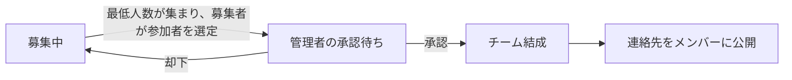

# teamsapp

## 1. サービス概要
　
### 初心者も参加できるチーム開発募集掲示板（フレームワークがあるから繰り返しチーム開発できる）

- （事前に役割を決めることで、参加者がいろんな役割のチーム開発を経験でき、失敗を繰り返す場所として機能し、アプリの完成だけではなく、チーム開発をする上での経験を積み、経験を大量に積むためのチーム開発ができる掲示板）

---

## 2. このアイデアはどこから生まれたか

### 2-1. きっかけとなった体験・感情

- 卒業制作のREADMEのレビューを何度も受けているうちに、私にとって卒業制作として身につけたい技術と、あまりに尖った内容は一般受けしない問題にぶち当たったこと、期間内にキャッチアップが可能なアプリか？などを考えた上で、複数の卒業制作のアプリの案を提出しているときに、作りたいアプリが複数ある中で、これが卒業制作として最も適しているアプリだと思ったから。

- 知識と経験を身につける手段として、もっとトライアンドエラーが大量にできる場はないのか？という問い
---

### 2-2. なぜそれが「気になった」のか

- 私の作りたいアプリは私自身が使いたいもの+尖ったものばかりで、一般受けしない可能性とキャッチアップが間に合わない可能性があったため、そういったバランスを考えた上で、需要がありそうで、私自身が技術を身につけられるレベルのアプリとレビューや人が集まりそうなアプリだと思ったから。

- 最速エッセンシャル思考

---

## 3. 課題の整理（表面的になっていないか）

### 3-1. 表に見えている困りごと

- チーム開発がなかなかできないこと　明確な決まりがない中でのチーム開発募集、経験者がいない可能性があること

- 最初の１番の障壁　「募集を見つけても、自分が参加してよいか判断できないこと」　特に初心者にはハードルが高い。

---

### 3-2. 本当に解決したい課題は何か

- チーム開発をしたいという潜在的需要はあるはずなのに、それが実行されるまでのコストがかかりすぎるので、そのコストをなくしたい。（コストとは心理的ハードル、共通認識ハードル、今まで経験したことがないことへのハードル、情報サーベイハードル）
- （特に初学者が何もわからない状態で、情報を探す労力もあり、チーム開発を経験できる掲示板はこのサイトでやるのだという共通認識を作りたい。また失敗しても良いから、体験し色々試行錯誤できる場所を作りたい）

---

## 4. 想定ユーザーについて

### 4-1. 想定しているユーザー

  - ターゲットは主に「rails基礎を終えてチーム開発を経験してみたい人と、個人開発は経験したがGitHubを使った複数人開発は未経験の人」
  - 個人開発までは自分で調べることができても、チーム開発までの道筋が複数人になると、複雑化し参入までの心理的ハードルなど複数面でコストが高いから。また野良掲示板では、最低限の共通知識や技術を求められることが多いから。またこういう決まりのある場所ですという決められたルールの中での掲示板であることで、共通認識が一致しやすく、雑多な情報や現象を排除できる。

---

### 4-2. 自分とユーザーの距離

私自身もあり、まだチーム開発をしたことがない、またチーム開発に慣れたい初学者のエンジニア

### 4-3. 実際に使われる可能性について(需要・存在確認)

- 需要については、個人開発者の中にも、チーム開発をしたことがない人たちがいること
- またチーム開発をしたかどうかが採用企業の評価にもつながってくる為に、そのアピールとしての存在需要が存在する。
- 初心者としてのチーム開発を経験できる場所がないこと。
- 探す場所、フレームワークのような場所がない為、参加する時間や心理的ハードルが高い
- また個別的に参加できても、繰り返し参加できる場所やフレームワークがない。

(※フィードバックを常にもらい改善する。)

- 現在はアプリの需要があるのかどうかのアンケートをgoogleフォームでとっております。
- 個別の需要のアンケートについては、タイミングを見計らい、需要有無についてアンケートをいただきたいと思います。
- 需要有無の　Google アンケートフォームは以下URL
https://docs.google.com/forms/d/e/1FAIpQLSfzT6WZfl-wgK2QODB_uK7xbJreLSJnJPxTtoMWNKPXWZSY-Q/viewform?usp=sharing&ouid=103515663513099036031

## 4-4. ユーザーがサービスを導入して利用するまでのイメージ(導入・継続の流れ)
 　　　　　　　　　

 - １、募集者が「目的」をまず書き出す。アプリ制作なのか、それとも部分的な実装までの目標のための共同開発なのか、また初心者も参加可能か、未経験の役割歓迎かどうかの表示をする。
 - ２、募集者が「最低限稼働人数」と「募集人数」を決めて、その数に応じた「役割」を何個かに分けて決めてもらう。「各役割の必要な時間数」、と「総時間数」、また「募集者が開発に使える時間」、「使う技術」、「経験したこと」、「この開発で経験したいこと」を書く（間違っていてもよい）
 - ３、 参加者がその中で経験したい役割を早い順で選び、共通連絡手段で可能なものを複数個選ぶ、またその際に（初心者としての参加なのかの有無、未経験の役割希望の有無、開発に使える時間、今できそうなこと、やってみたいこと、この開発で経験したいこと、やってみたい役割、使える技術、経験したこと、今できる役割）を募集者側に提供する。（どの役割がまだ決まっていないか、初心者でもOKか、役割未経験でもOKかマークがあるかどうかで判断する）
 - ４、最低募集人数が集まったら、募集者が参加者を選定する。
 - ５、最終的な承認を管理者に出す。
 - ６、管理者（アプリ製作者）からOKが出たタイミングで連絡場所を共有し、共通の連絡手段でチーム開発を指導する
 
 **「本リリースで追加する」**
 - ７、参加メンバー全員が各メンバーの責任や役割をレビューして評価をつけてもらう。

 

- 特に、管理者が承認する必要がある場合は、「どのような問題を防ぐためなのか」も整理してください。
- 極端に募集者の思想や偏りが見られる場合
- 差別的である場合の問題を防ぐため

　　　　　　　　　　
## 5. 既存サービス・競合調査

### 5-1. 似たサービスの調査

- このアプリの差別化ポイントは「フレームワーク　繰り返しができること　初心者でも参加できること」

- サービス名：ゲーム開発のチーム開発募集掲示板　（1日の開発の投稿数　３〜５件程度）
- URL：https://game-creators.camp/
- どんなことができるか：ゲーム制作のチーム開発の募集ができる

- サービス名：XなどのSNSで募集する（共通認識の場に欠け、求められること技術や共通認識に差があり、初心者が参加するにはコストがかかる）
- サービス名：オンラインコミュニティで声をかける(これも一つの手段ではあるが、それぞれどれだけ開発にかける時間があるのか、また経験者主導の場合が多く、失敗してもいいからとにかく経験するという
　このアプリの目的が達成できない)
- サービス名：プログラミングスクール内で募集する（現実に同期での募集が一番多い例と個人的にはみているが、気軽に「場」として提供できていない、いつも同じ人としかチーム開発ができない、いろんな心理的コストや時間の一致や同じ人としかできない可能性がある為、繰り返し開発が経験できる場所と共通認識の目的や決まりがある場所で募集するのとでは、また違いがあると思う）必要事項や役割などが曖昧な為、その役割しか経験できない可能性があるため、このアプリでは事前に何の役割でチーム開発をするのか？を人狼ゲームのように事前に決めるために（ランダム機能もあり）、ゲーム感覚で参加できるようになる　のがこのアプリの最終目標。

- サービス名：discordの各種プログラミングサーバー
どんなことができるか：チーム開発などができる。いろんな種類のコミュニティがあり、個別に相談しチーム開発などができる
（このアプリの差別化ポイント、掲示板での募集ではない為、Railsのようにチーム開発を繰り返す上での決まり（設定より規約）がはっきりしていない為、フレームワークとして機能せず、繰り返すフレームワークとして機能するには弱いと思う。

- サービス名:　compass (1日のコミュニティ活動の投稿数約３０〜５０)
- URL : https://connpass.com/
- どんなことができるか？:オンライン上やリアルでもくもく会、チーム　開発などができる。（フレームワークと2,３回はあっても繰り返しがない）
   

---

### 5-2. それでも自分が作りたい理由

- 既存サービスがある中で、いろんなハードルがある中で、気軽にチーム開発ができる場所がない。
- ゲーム開発などに手段が限られている点。

- 現状のチーム開発では、経験者が主導となって、チーム開発を経験するか
- または、入社後のチーム開発を経験するかなどの選択肢が限られ、気軽にチーム開発を経験できるサービスがないこと
- また失敗できる場所がないこと、会社に入ってからでは常に完全を求められ、経験が積めない、失敗できる場所がないこと

### 5-3. 差別化を「体験価値」で表現する

- 私のアプリの差別化ポイント：チーム開発を経験したい初学者が気軽にチーム開発の仲間を募集しチーム開発が可能な掲示板

- 一般的な掲示板ではどうしても、技術力や最低限の共通認識が求められ、こちらから情報を集めるのも、また参加の際の技術的心理的ハードルもあってどうしても「最も重要なことである経験ができない」
- またこの掲示板はチーム開発ができる掲示板だという共通の目的に認識がある為、通常の掲示板よりは、目的の一致と、目指すべき認識、マインドが重なりやすいため、参加コストが下がると想定している。
- また何の共通認識もなし集まった単体の場所であると、そういう場であるという共通認識が欠けているため瓦解しやすく、継続が不可能になりやすいと考えている。

- 技術力ではなく「一緒に学びたいこと」を基準に参加できる（参加後に任される役割まで最初の段階で明確化させる）
- 初心者歓迎のマークと役割未経験のマークも実装予定
- 使用技術・開発期間・活動時間・求める経験レベルが分かり、自分が参加できる募集か判断できる
- 初めて募集する人でも、必要事項に沿って募集内容を作成できる（時と状況によって実装保留）

---

## 6. このサービスで提供したい価値

### 6-1. ユーザーの変化

- チーム開発の募集ができることで、気楽にいろんな分野のチーム開発に参加でき、就職や転職でもチーム開発をした経験がアピールできるので、不満がなくなる。

### 6-2. 価値を一文で表す

- 「このサービスはチーム開発未経験者が、失敗を経験する場所として、チーム開発を繰り返しフレームワークのようにできるようになる可能性のある募集サービス」

- 失敗しても良い場所であるというのは初心者マークと未経験の役割のマークを提示する募集であることで、参加者全員が「初心者でも可能だったり、未経験の役割へ挑戦する場であると」認識できる

---

## 7. このアプリで実現すること

### MVPで作る機能
- 募集を投稿できる機能
- 一覧表示機能
- 詳細表示機能
- コメント投稿機能
- 参加のボタンなどの機能
- 実際に今参加希望している人間を示す機能
- 共通の連絡が取れる場所の指定を示すシステム
- チーム結成の承認拒否自体は募集者が完成するまで承認し、最終的には管理者に提出する
- 募集者がどのような情報を入力するか（目的、初心者参加可否、未経験の役割歓迎の有無、最低稼働人数、募集人数、役割、各役割の必要時間、総時間数、募集者が開発に使える時間、使う技術、経験したこと、この開発で経験したいこと）を入力する部分
- 参加希望者がどのような情報を入力するか（初心者としての参加なのかの有無、未経験の役割希望の有無、開発に使える時間、今できそうなこと、やってみたいこと、この開発で経験したいこと、やってみたい役割、使える技術、経験したこと、今できる役割）を入力する部分

- 役割や時間を入力するシステム、初心者マークや未経験の役割歓迎マークを表示するかしないか
- ログインログアウト機能
- 管理者への提出機能
- 管理者権限機能

- MVPで確認したいこと。
「実際にチームが成立して,連絡を取り合う場で連絡を取り合うようになること。」

### 本リリースで作る機能

- 参加希望者が自分に合う募集をどう探すか　検索機能をつける
- ユーザーレビューを投稿できるシステム 
- UI・UXの改善 
- 使用経路の簡易化、
- 利用規約/プライバシーポリシー
## 8. このアプリの懸念点とその対策

- １、私自身がチーム開発未経験のため、その経験がない中で想定していないトラブルが起きそうな懸念。

- ２、参加後に連絡が途絶える
- (対策)
- 1.成立時に2日以内に最初の連絡を取ることを掲示板のルールに入れる。
- （本リリース時）2.レビュー評価機能を付け加えることで、責任感を各ユーザーに植え付ける。

**「そもそも最初の募集が1件も投稿されない」ことが最初の関門について**
- ユーザーテスト自体は私自身が行い、実際に同期などに喧伝し、利用してもらいレビューをもらう。

## 9. 今後の展開・発展の方向性

- このアプリは、チーム開発をしたことがない初学者エンジニアが存在する限り需要はある。
- またチーム開発のボランティアをしたいという人がいるかもしれないので、その人に経験者として主導してもらう.
- また需要があれば、経験者にチーム開発のメンバーがお金を払い、チーム開発を経験するシステムなどを作っても良い。

### 観点

- ユーザーはなぜ使い続ける？　いろんな技術が身につく機会があるから
- 続けることで何が変わる？　チーム開発に対して漠然としたものだとしても経験することができるので、不満が解消される

## 10. 技術スタック（手段としての技術）

### 10-1. 使用予定の技術

- フレームワーク：Ruby on Rails
- DB：PostgreSQL
- デプロイ先：Render
- フロントエンド：Hotwire（Turbo / Stimulus）、Tailwind CSS

#### 使用予定ライブラリ（Gem）

**MVP**
- devise / devise-i18n：ログイン・ログアウト機能
- pundit：管理者権限・募集者権限の管理
- rails-i18n / enum_help：日本語化、役割やステータスの表示
- kaminari：募集一覧のページネーション
- tailwindcss-rails：画面のスタイリング

**本リリース**
- ransack：募集の検索・絞り込み機能
- acts-as-taggable-on：使用技術のタグ付け
- meta-tags：OGP 設定

**テスト・開発**
- rspec-rails / factory_bot_rails / faker / capybara：テスト
- rubocop / brakeman / bullet：コード品質・セキュリティ・N+1 の検出
- letter_opener_web：開発環境でのメール確認

※ Active Record は Rails の標準機能として、ユーザー・募集・役割・応募の関連づけに使用

---

### 10-2. 技術選定の比較検討

選定の基準は「2か月・1人で完成できること」「日本語の情報が多く、詰まっても自分で解決できること」です。

#### フレームワーク

このアプリはユーザーの募集、応募といったデータを登録・表示・更新する機能が中心で、2か月という短い期間に1人で完成させる必要がありました。そのため、この種類のWebアプリを素早く作れることを重視してRailsを選びました。

１つ目は、ユーザーと募集、募集と応募のようなデータ同士の関係を、Active Recordで簡単に表現できることです。
２つ目は、書き方の決まり（設定より規約）がはっきりしているため、経験が浅くてもコードの置き場所に迷わず、あとから読みやすいコードにできることです。

| 候補 | 採用/不採用 | 理由 |
| --- | --- | --- |
| Ruby on Rails | 採用 | 募集・応募のようなデータの登録・表示・更新が中心のアプリを、1人で素早く作れる |
| Django（Python） | 不採用 | 管理画面が標準である点は魅力だが、Python を一から学ぶ時間が必要になる |
| Laravel（PHP） | 不採用 | これまで学習してきた Ruby / Rails の知識を活かせない |
| Next.js ＋ API サーバー | 不採用 | フロントとバックエンドを分けると作るものが倍になり、2か月では間に合わない |

#### フロントエンド

| 候補 | 採用/不採用 | 理由 |
| --- | --- | --- |
| Hotwire（Turbo / Stimulus） | 採用 | Rails 標準で、参加ボタンを押したときの画面更新を再読み込みなしで実装できる |
| React | 不採用 | 別に学習が必要で、API との二重開発になり期間内に終わらない |

#### CSS

| 候補 | 採用/不採用 | 理由 |
| --- | --- | --- |
| Tailwind CSS | 採用 | 初心者マークなどのバッジの色や形を細かく調整しやすい |
| Bootstrap | 不採用 | 手軽だが、見た目がほかのサイトと似たものになりやすい |

#### データベース

| 候補 | 採用/不採用 | 理由 |
| --- | --- | --- |
| PostgreSQL | 採用 | デプロイ先の Render が標準で用意しており、設定の手間が少ない |
| MySQL | 不採用 | Render では標準で用意されておらず、別のサービスを契約する必要がある |
| SQLite | 不採用 | Render の無料プランではサーバーの再起動でデータが消えてしまう |

※ Render の無料 PostgreSQL には利用期限があるため、本番運用前に料金プランを確認します。

#### デプロイ

| 候補 | 採用/不採用 | 理由 |
| --- | --- | --- |
| Render | 採用 | GitHub に push するだけで自動デプロイでき、サーバーの知識が少なくても公開できる |
| Heroku | 不採用 | 無料プランがなく、学習段階ではコストがかかる |
| Kamal | 不採用 | Rails 8 標準だが、自分でサーバーを用意・管理する必要がある |
| GitHub Pages | 不採用 | HTML などの静的なファイルしか公開できず、Rails やデータベースを動かせない |
| Vercel | 不採用 | Next.js などのフロントエンド向けで、Rails を常に動かし続ける使い方には向いていない |

#### CI/CD

| 候補 | 採用/不採用 | 理由 |
| --- | --- | --- |
| Render の自動デプロイのみ | 採用（MVP） | 追加の設定なしで push するだけで公開でき、まず動くものを出すことを優先できる |
| GitHub Actions | 採用（本リリース） | push のたびにテストを自動で実行し、失敗したコードが公開されるのを防げる |

#### 認証

| 候補 | 採用/不採用 | 理由 |
| --- | --- | --- |
| devise | 採用 | 登録・ログイン・パスワード再設定まで一通りそろっており、日本語の記事も多い |
| Rails 8 標準の認証ジェネレーター | 不採用 | ユーザー登録画面を自分で作る必要があり、期間内の完成を優先した |

#### 権限管理

| 候補 | 採用/不採用 | 理由 |
| --- | --- | --- |
| pundit | 採用 | 「その募集の作成者か」「管理者か」「承認済みメンバーか」の判定をモデルごとに整理でき、テストも書きやすい |
| cancancan | 不採用 | ルールが1ファイルに集まるため、機能が増えると読みにくくなる |
| 自作（コントローラーに if 文） | 不採用 | 連絡先の表示制限などで確認漏れが起きると、個人情報の問題につながる |

#### 承認の流れ（募集・応募の状態管理）

| 候補 | 採用/不採用 | 理由 |
| --- | --- | --- |
| Rails 標準の enum | 採用 | 状態の数が少ないため、標準機能だけでシンプルに管理できる |
| aasm | 不採用 | 状態の数に対して機能が多すぎる |

#### 初心者マーク・役割未経験歓迎マーク

| 候補 | 採用/不採用 | 理由 |
| --- | --- | --- |
| true / false のカラム（Rails 標準） | 採用 | 「表示する・しない」の切り替えだけなので、gem を使わずに実装できる |
| acts-as-taggable-on（タグ） | 不採用 | 自由に追加できるタグにすると、表記がばらついてマークの意味が伝わりにくくなる |

#### 共通の連絡・管理手段

チーム開発では、日常の連絡だけでなく、タスク管理や打ち合わせの手段も必要になります。そのため連絡手段を LINE だけに限らず、用途ごとに選べるようにします。

| 用途 | 選べるツール |
| --- | --- |
| テキストチャット（日常の連絡・質問・雑談） | LINE オープンチャット / Slack / Discord / Microsoft Teams |
| タスク・進捗管理（誰が何を担当しているか） | GitHub（Issues / Projects） / Trello / Jira / Notion |
| Web 会議・音声通話（朝会・込み入った相談） | Zoom / Google Meet / Discord のボイスチャンネル / Slack のハドル |

- 募集者は、用途ごとに使うツールを選び、招待 URL を入力します。
- 参加希望者は、応募するときに自分が使えるツールを複数選びます。
- 招待 URL は、管理者の承認後にチームメンバーだけに表示します。

| 候補 | 採用/不採用 | 理由 |
| --- | --- | --- |
| 招待 URL を入力して承認後に表示 | 採用 | どのツールでも URL を承認されたメンバーだけに見せればよく、実装が簡単 |
| LINE Messaging API などの外部連携 | 不採用 | ツールごとに審査や設定が必要で、MVP の期間では難しい |
| アプリ内チャット | 不採用 | リアルタイム通信の実装が必要になり、2か月では間に合わない |

ツールの選択肢の持ち方は、次のように比較しました。

| 候補 | 採用/不採用 | 理由 |
| --- | --- | --- |
| ツールのマスタテーブル＋中間テーブル | 採用 | ツールの追加がデータの追加だけで済み、ツールごとの招待 URL も持てる |
| PostgreSQL の配列カラム | 不採用 | 手軽だが、ツールごとの招待 URL を一緒に保存しにくい |
| 自由入力のテキスト | 不採用 | 「slack」「スラック」のような表記ゆれが起き、本リリースの絞り込み検索に使えない |

#### テスト

| 候補 | 採用/不採用 | 理由 |
| --- | --- | --- |
| RSpec | 採用 | Rails のテストで最もよく使われており、日本語の学習資料が多い |
| Minitest | 不採用 | Rails 標準だが、RSpec に比べて日本語の資料が少ない |

---

