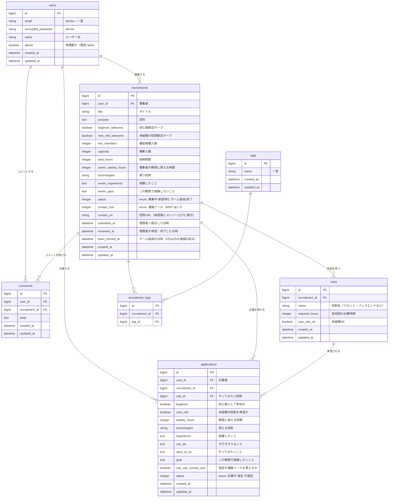

# ER 図

README の「7. このアプリで実現すること」と「10. 技術スタック」、画面遷移図（Figma）をもとにした、MVP のデータ設計です。

## 設計のポイント

- **チームメンバー**は専用のテーブルを作らず、`applications.status` が「選定」の応募者で表します。連絡先（`contact_url`）は、募集の状態が「チーム結成」のときに、この応募者と募集者だけに表示します（pundit で判定）。
- **募集の状態**は `recruitments.status` の enum で持ちます。「却下」は状態ではなく「募集中に戻す」操作なので、`reviewed_at` に日時だけを残します。
- **管理者**は `users.admin` の真偽値で表します。管理者の承認・却下ページは、この値で表示を切り替えます。
- **連絡ツール**は MVP では募集テーブルの `contact_tool`（enum）と `contact_url` で持ちます。本リリースで用途ごとに複数選べるようにするときに、ツールのマスタテーブルと中間テーブルへ分けます（README の比較どおり）。
- **画像**（募集の画像投稿）は Active Storage を使うため、ER 図には出していません。`active_storage_attachments` が `recruitments` を指します。
- **タグ**は、画面遷移図の「タグ管理ページ」に合わせて `tags` と中間テーブル `recruitment_tags` で持ちます。README が本リリース用に挙げている acts-as-taggable-on（使用技術のタグ付け）とは別物です。
- 応募は、同じ人が同じ募集に二重に応募できないよう、`applications` に `user_id` と `recruitment_id` の組の一意制約をつけます。
- `comments` は、画面遷移図のとおり募集詳細ページの中で扱います。投稿・編集・削除は、コメントを書いた本人だけができます。
